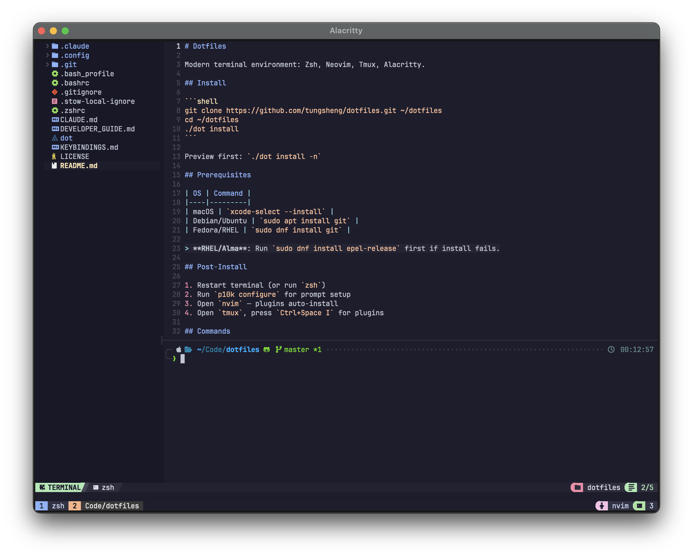

# Dotfiles

Modern terminal environment: Zsh, Neovim, Tmux, Alacritty. Inspired by [Dreams of Code](https://www.youtube.com/watch?v=DzNmUNvnB04).



## Prerequisites

| OS | Command |
|----|---------|
| macOS | `xcode-select --install` |
| Debian/Ubuntu | `sudo apt install git` |
| Fedora/RHEL | `sudo dnf install git` |

> **RHEL/Alma**: Run `sudo dnf install epel-release` first if install fails.

## Install

```shell
git clone https://github.com/tungsheng/dotfiles.git ~/dotfiles
cd ~/dotfiles
./dot install
```

Preview first: `./dot install -n`

## Post-Install

1. Restart terminal (or run `zsh`)
2. Run `p10k configure` for prompt setup
3. Open `nvim` — plugins auto-install
4. Open `tmux`, press `<prefix> I` to install plugins (`<prefix>` = `Ctrl+Space`)

## Commands

| Command | Description |
|---------|-------------|
| `./dot install` | Install dotfiles |
| `./dot update` | Pull latest + update plugins |
| `./dot install -n` | Preview (dry-run) |
| `./dot uninstall` | Remove symlinks |
| `./dot health` | Full status check |
| `./dot status` | Quick overview |

## Structure

```
.zshrc / .bashrc           Shell configs
.config/nvim/              Neovim (Lazy.nvim)
.config/tmux/              Tmux (TPM)
.config/alacritty/         Terminal (Tokyo Night)
.config/gh/                GitHub CLI
.config/ruff/              Python linter/formatter
.config/shell/aliases.sh   Shared aliases
```

## Key Bindings

| Context | Key | Action |
|---------|-----|--------|
| Tmux | `Ctrl+Space` | Prefix |
| Cross-tool | `Ctrl+h/j/k/l` | Navigate panes/splits |
| Neovim | `Space` | Leader |
| Neovim | `<leader>ff` | Find files |

See [KEYBINDINGS.md](docs/KEYBINDINGS.md) for complete reference.

## Manual Install

<details>
<summary>Using stow directly</summary>

```shell
# Install stow, then:
cd ~/dotfiles && stow .
```
</details>

## License

[MIT](LICENSE) · [Developer Guide](docs/DEVELOPER_GUIDE.md)
