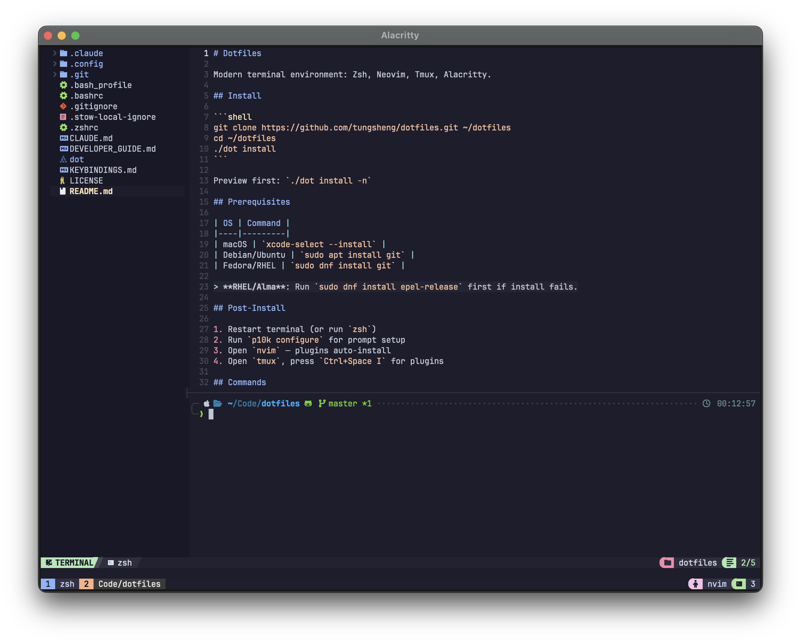

# Dotfiles

Terminal setup built around Zsh, Neovim, Tmux, and Alacritty. Inspired by [Dreams of Code](https://www.youtube.com/watch?v=DzNmUNvnB04).



## Prerequisites

| OS | Command |
|----|---------|
| macOS | `xcode-select --install` |
| Debian/Ubuntu | `sudo apt install git` |
| Fedora/RHEL | `sudo dnf install git` |

> **RHEL/Alma**: Run `sudo dnf install epel-release` first if install fails.
>
> **macOS**: Install Homebrew from [brew.sh](https://brew.sh) before running `./dot install`.
>
> **Fedora/RHEL**: `zoxide` is not installed by `dnf` in this setup; install it separately if you want directory jumping.

## Install

```shell
git clone https://github.com/tungsheng/dotfiles.git ~/dotfiles
cd ~/dotfiles
./dot install
```

Preview first: `./dot install -n`

## Post-Install

1. Restart terminal (or run `zsh`)
2. Run `p10k configure` for prompt setup
3. Shell helpers, pinned Zsh plugins, Neovim plugins, and Mason tools are bootstrapped during `./dot install`
4. Open `nvim`; if editor tools are still missing, run `:MasonInstallAll`
5. Open `tmux`, then press `<prefix> I` to install TPM plugins (`<prefix>` = `Ctrl+Space`)
6. Run `./dot health` to verify the install

## Environment Files

Interactive shells auto-load `~/.env` first, then the rest of `~/.env*` in sorted order.

- Supported syntax: `KEY=VALUE` or `export KEY=VALUE`
- Files are parsed as data, not sourced as shell code
- Files must be regular files owned by you and deny all group/other access, for example `chmod 600 ~/.env ~/.env*`
- Later files override earlier values when the same key appears more than once

## Commands

| Command | Description |
|---------|-------------|
| `./dot install` | Install dotfiles |
| `./dot update` | Pull latest + sync extras + update plugins |
| `./dot install -n` | Preview (dry-run) |
| `./dot uninstall` | Remove symlinks |
| `./dot health` | Full status check |
| `./dot status` | Quick overview |

## Layout

```
dot                        Thin installer entrypoint
scripts/dot/               Installer internals split by concern
.config/shell/             Shared shell bootstrap, aliases, env loading
.config/nvim/              Neovim (NvChad + Lazy.nvim)
.config/tmux/              Tmux (TPM)
.config/alacritty/         Terminal (Tokyo Night)
.config/gh/                Shared GitHub CLI config
docs/                      Maintainer guide, changelog, keybindings
```

## Docs

- [docs/README.md](docs/README.md) for the doc map
- [docs/DEVELOPER_GUIDE.md](docs/DEVELOPER_GUIDE.md) for maintainer workflows
- [docs/KEYBINDINGS.md](docs/KEYBINDINGS.md) for keymaps and shell aliases
- [docs/CHANGELOG.md](docs/CHANGELOG.md) for release history

## Key Bindings

| Context | Key | Action |
|---------|-----|--------|
| Tmux | `Ctrl+Space` | Prefix |
| Cross-tool | `Ctrl+h/j/k/l` | Navigate panes/splits |
| Neovim | `Space` | Leader |
| Neovim | `<leader>ff` | Find files |

See [docs/KEYBINDINGS.md](docs/KEYBINDINGS.md) for complete reference.

## Manual Install

<details>
<summary>Using stow directly</summary>

```shell
# Install stow, then:
cd ~/dotfiles && stow .
```
</details>

## License

[MIT](LICENSE) · [Docs Index](docs/README.md)
